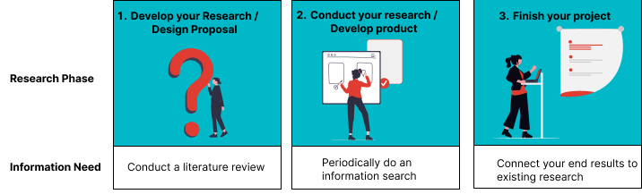

# Overview
When doing your master thesis, there are multiple points where you will need information from others. For example, you need to find out what others have done so you can find out what would be a good research question to start working on. Perhaps you need to find out how others have designed a specific product so you can reuse or build further around this method. Or maybe you have done your research and need to see how your findings relate to what other researchers have found. To be able to do this effectively and responsibly during your master thesis, you will need the following information skills: <br><br>

<br>
Adapted from "<a href=https://www.shb-online.nl/information-literacy-en/subject-matter/ target=_blank>Visualisatie leerlijn Information Literacy</a>" by <a href=https://www.shb-online.nl/information-literacy-en/subject-matter/ target=_blank>Edo-Jan Meijer</a> is licensed under <a href=https://creativecommons.org/licenses/by-nc/4.0/deed.en target=_blank>CC-BY-NC</a>.<br>

1. **Explore**: Apply basic steps for orientation on the topic or question of your master thesis 
2. **Search**: Set up and store a basic search strategy for scientific literature for your master thesis 
3. **Evaluate**: Use basic ways to assess relevance and reliability of sources, select information for your master thesis and know how to store information effectively
4. **Process**: Understand how to read, summarise and synthesise during your master thesis
5. **Share**: Apply correct citation and copyright practices when handing in your master thesis. Know about open science principles when publishing your research.

In the guide we present the skills back to back, and provide you with best practices for each of them. Note that these skills are sometimes indeed sequential, but you will also find that throughout your project you will be revisiting them multiple times as during the different phases of a master thesis you will have different information needs. In addition, your need for information will differ depending on which type of project you are doing (for example designing a new product versus doing experimental research). 

Below you can find an overview of the different phases of a master thesis, and the information needs you will have for each of them:<br><br>
<br>

**1: Develop your Research / Design Proposal**: <br>
When you start your project, you conduct an in-depth review on what others have done (literature review), based on a preliminary research question or design challenge. These results help you formulate your final research or design proposal (for example, what knowledge gap will you address, what methods will you use?).  

**2: Conduct your Research or Develop your Product**:  <br>
As you are doing your actual research or design, you will likely encounter interesting findings, or run into issues. At these points, returning to literature can help you reflect on your findings, or help you find new approaches to doing your project. Moreover, especially when you are doing a longer-term project, like a thesis,  you should periodically search for sources, based on new concepts you will encounter, the results you are finding, and to check if any new research has come out. While doing your project, you reflect on your findings and connect them to the literature you have already found. This can also help you if need to update your research or design methods.  

```{admonition} Tip
:class: tip
Don't wait until the end to write down all your observations: try to already note down your insights and start processing and engaging with your sources and synthesising as you are doing your project to save you time in the end.   
```

**3: Finish your Project**:  <br>
When you finish your project and write your conclusion and discussion, you synthesise your observations, findings and notes with what others have done. This means looking once more at the sources you have processed throughout your project, and discussing how your findings connect to these sources. In addition, in this phase, citing and using copyright correctly as you reuse the work of others becomes even more important as you are sharing it with others.

## On AI and Information Skills
Throughout the guide we will occasionally discuss the use of AI. GenAI tools can be helpful during the research process if they are used correctly. At the start of your project, you should check whether you are allowed to use these tools, and in what way. For more information on acknowledging your use of AI you can also have a look at [this section](5b-specifying-ai-use.md).

```{admonition} THESIS SUPERVISOR
:class: important
It is strongly suggested that you discuss your planned AI use with your thesis supervisor and check what is allowed.
```

GenAI use comes with a lot of considerations, and this means you should critically evaluate the output of a tool, as well as the need to use a tool. We provide here some general considerations you should take into account, as well as five principles on working with AI in general. Where relevant, we provide additional considerations in related chapters.

````{tab-set}

```{tab-item} Privacy and Security

For your project, you might be working with sensitive data, like company data or personal information. It is often unclear how the input (prompts) from users are processed in GenAI tools. These could also be (and often are) used for training purposes. It is therefore important to never insert personal details or confidential information in GenAI tools. If you are allowed to use AI, and are handling confidential information, consider using a tool that will run AI models locally on your laptop, like <a href="https://ollama.com/" target=_blank>Ollama</a>.

```

```{tab-item} Errors

AI tools can produce incorrect or misleading information. The output of AI systems can, for example, include citations that look realistic, but don't really exist. Ask any AI to find you some academic sources on a topic and you are presented with a plausible list of seemingly high quality scientific sources. However, these references don’t always exist. For example; In July 2026, research from the Dutch magazine <a href=https://www.groene.nl/artikel/de-wetenschap-wordt-in-sneltempo-vervuild target=_blank>De Groene Amsterdammer</a> revealed that, since the release of ChatGPT, the proportion of scientific articles containing non-existing references has increased sevenfold (read about the research in English <a href=https://delta.tudelft.nl/en/article/number-of-ghost-references-in-scientific-articles-growing-rapidly target=_blank>here</a>). You should always verify the output of AI with reliable sources.

```

```{tab-item} Biases

GenAI tools are trained with real-life data. The output can therefore reflect and amplify biases from human thinking. For example, research has shown that outputs of GenAI tools often include biases against women and people of colour. Other biases, for example confirmation bias (the tendency to search for and favour information that confirms your beliefs), can also affect the data that is used for training the GenAI tool, and therefore also affect the output. So, also from the perspective of potential biases, it is important to always critically check the GenAI output.

```

```{tab-item} Copyright

GenAI tools are trained with data that is publicly available. However, the authors of the texts that are used for training purposes did not give permission for this. Although GenAI output does not typically include directly copied passages, often it does include extracted patterns and styles from the works of others. This leads to a grey area of potential copyright infringement. 
```

```{tab-item} Deskilling

Completely outsourcing tasks to GenAI tools is not smart, not only because of the possible inaccuracies and biases in the output, but also because it leads to overreliance on GenAI. Overreliance, in turn, can lead to loss of creativity and critical thinking skills. 

```

```{tab-item} Environment

The environmental impact of GenAI use is significant: great amounts of water and energy are necessary for running the models (i.e., responding to prompts) and training them. Although this is a personal consideration, you could take this into account when you are considering using GenAI tools.

```
````


```{admonition} Five principles for working with AI
:class: dropdown tip

For effective and responsible GenAI use, keep the following five principles in mind:

1. Prompt: Effective GenAI use starts with an effective prompt. Make your prompt specific, using (relevant elements from) the format: clear task-description + persona + context + format + tone + exemplars

2. Proof: Always check the output for inaccuracies and biases. Critically evaluate the quality of the output, using your own critical thinking skills.

3. Privacy (and other considerations): There are many unknowns about how GenAI tools use your input. _Never_ feed personal details or confidential information to GenAI tools. Also consider the environmental impact of GenAI before using it.

4. Presentation: The output from GenAI tools may include grammatically correct sentences, but it is often generic and flavourless. Don’t forget about your own voice when you are writing a text.

5. Property: In the end, always remember that you are responsible for your work, also when you use GenAI.

Adapted from "Summary Part 1: Effective and Responsible GenAI Use". Walma, L., & Looij, M. <a href=https://ai-for-literature-review.github.io/Guide/part1/evaluating-output.html target=_blank>AI for Literature Review</a> is licensed CC-BY

```

## References
- Meijer, E.-J. (2023). Visualisation learning trajectory information literacy. Subject Matter - Information Literacy. <a href=https://www.shb-online.nl/information-literacy-en/subject-matter/ target=_blank>https://www.shb-online.nl/information-literacy-en/subject-matter/</a>
- Walma, L., & Looij, M. <a href=https://ai-for-literature-review.github.io/Guide/part1/evaluating-output.html target=_blank>AI for Literature Review</a>
