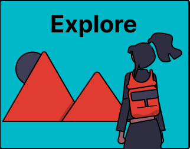

# 1. Explore

## Introduction:

When you begin your thesis you are also at the start of your information journey. You might have some idea about your topic already, or maybe even a preliminary research question or design challenge. Exploring is about familiarising yourself more with your topic so that in the next phase you can do a focused search for the information you need. By exploring, you refine what information search questions or perhaps even thesis research question you want to answer and learn more about the broader academic context of your topic.

Common activities during this phase of the your information journey include:

- [1a. General Orientation on a Topic](1a-brainstorming.md) - Know how to do a general orientation on your topic 
- [1b. Formulate a Question](1b-formulate-research-question.md) - Know how to formulate an information search question 
- [1c. Explore Academic Literature](1c-exploring-academic-literature.md) - Know how to do an initial exploration of academic literature 

## Test Your Current Knowledge
Before studying the recap and additional skills useful for your master thesis take this knowledge test to find out how much you already know:

<iframe src="https://tudelft.h5p.com/content/1292839897158947867/embed" aria-label="1 - Explore - Knowledge Test" width="1088" height="637" frameborder="0" allowfullscreen="allowfullscreen" allow="autoplay *; geolocation *; microphone *; camera *; midi *; encrypted-media *"></iframe>

## Exploration Template for Your Master Thesis 
Want to get started with searching for your project right away? 

- Use the [Exploration Template](1-handout-exploration.docx) to fill in as you go through the pages or to set up and store your findings for the orientation part of your master thesis.

