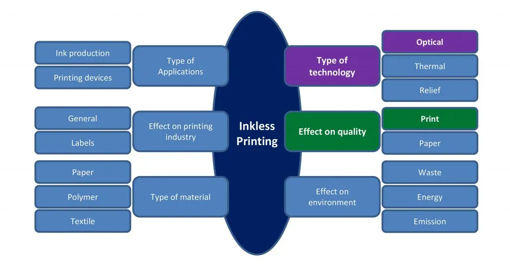

# 1a. Brainstorm

## Introduction

When you get started with your thesis, you may or may not already have a topic in mind. To expand and shape your knowledge, writing down what you know about a topic, as well as performing some general searches can help you focus your research and work towards an information search question.

::::{grid}
:gutter: 2

:::{grid-item-card} Step 1<br>
[Choose a Topic](#step-1-choose-a-topic-and-write-what-you-know)<br>
Choose a topic and write your initial knowledge

:::

:::{grid-item-card} Step 2<br>
[General searches](#step-2-perform-general-searches-on-your-topic)<br>
Perform general searches on your topic

:::

::::

## Step 1: Choose a Topic and Write What You Know
How to find a topic of interest? 

Some suggestions from Maastricht University can help you to make this process easier (Maastricht University Library, 2016):
- Choose a topic you like
- Talk to others about what topic you would like to study
- Think about your future career
- Look for a topic that builds on existing research rather than doing something completely new to avoid that your project becomes too big.
- Look into current events for inspiration

Once you have an initial topic you are interested in, you can write down what you already know about the topic. There are multiple techniques you could use for this. You can find some examples in the tab below. For more techniques, you can consult <a href="https://writingcenter.unc.edu/tips-and-tools/brainstorming/" target=_blank>this guide</a>  (the Writing Center of The University of North Carolina, n.d.)

````{tab-set}

```{tab-item} Freewrite

When you freewrite, you set a timer and just begin writing on your topic without stopping (for example for 15 minutes, or a specific number of pages). You can do this by hand or on a laptop, as you prefer. After you are done writing, re-read what you wrote and filter out any specific ideas or knowledge that strike you as relevant. You can place these in a new overview or list and develop your brainstorm further from this point. 

```
```{tab-item} Mindmaps

A mindmap is a visual way of analysing your subject. Start with your subject or research topic in the middle and think of related areas. For each area come up with more specified topics and examples. You can use specific software to do this, or you could also use post-its on paper.

An example of a mindmap is found in the image below:


"Mindmap" by TU Delft Library Education Support is licensed CC-BY-SA

Possible questions that can be derived from the mindmap are:

- How can the automotive industry contribute to the improvement of air quality by adapting existing fuels?
- How can the automotive industry improve the environmental impact through material recycling in car design?
- Do car free zones have a positive impact on societal behaviour and impact the automotive industry?

Making a mindmap map from the information you have available gives you a clearer overview of your subject. You can then use the mindmap to begin to formulate various information search questions. For more infromation on how to make mindmaps see also: <a href="https://www.youtube.com/watch?v=u5Y4pIsXTV0" target=_blank>How to Mind Map with Tony Buzan</a>


```

```{tab-item} Six questions
Answer the six journalistic questions about your topic: 

These are:
- Who?
- What?
- When?
- Where?
- Why?
- How?

Write them down and try to answer each one of these questions for your initial topic. By doing this you activate your own pre-existing knowledge about the topic, and you can then supplement your initial ideas with information from general searches.

```
````

## Step 2: Perform General Searches on Your Topic
Next, you can search online to find some additional sources to expand your knowledge on the topic and add to your initial brainstorm. In the tab below you can find some more information from <a href="https://www.tudelft.nl/tulib/searching-resources/making-a-search-plan" target=_blank>TUlib</a> on helpful resources to use to further supplement your initial brainstorming (TU Delft Library Education Support, n.d.).


````{tab-set}

```{tab-item} General Search Engines

Think of relevant concepts that are related to your subject and perform general searches in Google, Wikipedia or dictionary to find useful terms. You could also look into handbooks from your studies. If you want to search anonymously on the internet you can use alternative search engines like DuckDuckGo (data from more than 50 search engines, does not store IP addresses and search data), Startpage (does give Google results, but also serves as a proxy -wall- between you and Google) and Gibiru (search results are sourced by a modified Google algorithm).

```

```{tab-item} AI
If you are allowed to use AI in your thesis project, you can ask Copilot a question to get a feel for your topic. Use it in the same way you would use Google or Wikipedia. You can use the same question in multiple AI tools to see what they have to say and how they compare (Walma & Looij, 2025). For more information on this you can also consult the <a href= "https://ai-for-literature-review.github.io/Guide/part2/brainstorming.html#ai-assist-general-searches-on-your-topic" target=_blank>AI for Literature Review Guide</a> 

```
```{tab-item} News, trade journals, books

These information sources often provide information that is not too specific and are a good place to start an orientation. A good resource to use at TU Delft is <a href="https://www.nexisuni.com/" target=_blank>Nexis Uni</a>, which includes a lot of national and international newspapers and magazines.

```

```{tab-item} Academic Databases
To help brainstorm, you can search for your topic in a multidisciplinary academic database like Scopus or Dimensions and in subject-specific catalogues or databases for your research field. Don't start reading articles right away, but check the titles, abstracts and keywords of documents you find useful. You can add these terms to your concept map, list them somewhere or add them to your initial brainstorm to further shape your topic. 

```

```{tab-item} Scientific Review Articles
While academic articles are too specific to use in a brainstorm phase, review articles, which can be found in academic databases, provide an overview of research done in a field and can help to uncover latest information in a field quickly. In Dimensions and Scopus, you can filter specifically for review articles.

```

````


## References
- How to choose a thesis topic. (2016, March 29). Maastricht University Library. https://library.maastrichtuniversity.nl/study/thesis-supportall/choose-thesis-topic/
- The Writing Center, University of North Carolina at Chapel Hill. (n.d.). Brainstorming. The Writing Center. Retrieved March 2, 2026, from https://writingcenter.unc.edu/tips-and-tools/brainstorming/
- TU Delft Library Education Support. (n.d.). Making a search plan. TUlib. Retrieved March 2, 2026, from https://www.tudelft.nl/tulib/searching-resources/making-a-search-plan
- Walma, L., & Looij, M. (2025). Brainstorming on Your Topic—AI for Literature Review. Retrieved March 2, 2026, from https://ai-for-literature-review.github.io/Guide/part2/brainstorming.html#ai-assist-general-searches-on-your-topic
