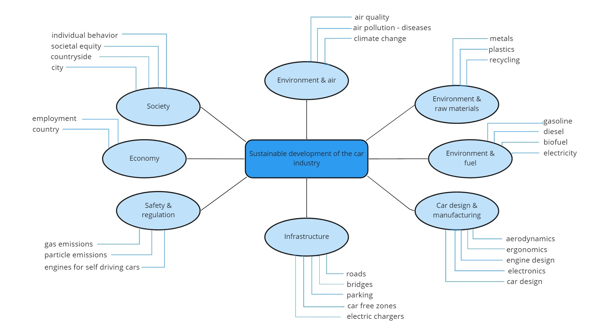

# 1b. Formulate an Information Search Question

## Introduction

Once you have your topic, it is time to formulate an information search question. This is a process that requires time and thought, and importantly; specifying exactly what you want to study. What information do you need to further shape your project?

::::{grid}
:gutter: 2

:::{grid-item-card} Step 1<br>
[Define Components](#step-1-defining-components-of-an-information-question)<br>
Define the initial building blocks of your question

:::

:::{grid-item-card} Step 2<br>
[Specify Further](#step-2-further-specifying-your-question)<br>
Break your question down into broader or more narrow components

:::

::::

## Step 1: Defining Components of an Information Question

When you have done an initial exploration of your sources, take your mind map or summaries and try to formulate a question. You should define the who, what, where and why you are going to study. 

<a href="https://libguides.uvt.nl/tip-tutorial/research-question" target=_blank>Tilburg University</a> has some good considerations on formulating a relevant research question for an information search. It should be: 
- Clear
- Specific
- Manageable within the time you have
(Lier, M. van., n.d.)

### Example Research scenario

In this scenario, we have made a concept map from the information we have brainstormed around our subject. We can then use the concept map to formulate various information search questions. You formulate research questions by looking at the relations and dependencies of different branches of the concept map.


"Mindmap" by TU Delft Library Education Support is licensed CC-BY-SA

Possible questions that can be derived from the mind map are:

- How can the automotive industry contribute to the improvement of air quality by adapting existing fuels?
- How can the automotive industry improve the environmental impact through material recycling in car design?
- Do car free zones have a positive impact on societal behaviour and impact the automotive industry?

A research question can get too complex to solve at once. To create more structure and make the research question more manageable, it can be helpful to divide it into sub-questions.

```{admonition} Example Subquestions
:class: dropdown tip
Below some subquestions based on our initial example:

- What is the definition of “automotive industry”?
- What kinds of existing fuels are used in the automotive industry?
- How can research into fuel contribute to the improvement of air quality?
-Why should the automotive industry contribute to the improvement of air quality?
- Who would benefit from the improvement of air quality?  
- Who would benefit from adapting the existing fuels?
- Where is the greatest need for improvement of air quality?
```

## Step 2: Further Specifying Your Question

Once you have your initial question, you can look at its different components and make them more or less specific. The example below from Maastricht University provides an example on more narrow and broader components of a specific question.

<iframe src="https://library-edu-content.maastrichtuniversity.nl/wp-admin/admin-ajax.php?action=h5p_embed&id=205" width="758" height="452" frameborder="0" allowfullscreen="allowfullscreen" title="RD13-Formulating research question"></iframe><script src="https://library-edu-content.maastrichtuniversity.nl/wp-content/plugins/h5p/h5p-php-library/js/h5p-resizer.js" charset="UTF-8"></script>

<a href="https://maastrichtuniversity.libwizard.com/f/research-question?utm_source=edusources.nl&utm_content=link" target="_blank">"From broad to narrow: writing your research question"</a> by Maastricht University Library is licensed CC-BY-SA

Need more information? Check out this guide from <a href="https://maastrichtuniversity.libwizard.com/f/research-question?utm_source=edusources.nl&utm_content=link" target="_blank">Maastricht University</a>

```{admonition} THESIS SUPERVISOR
:class: important
Once you have formulated an initial information search question, this is a great moment to get feedback from your supervisor. You can also try to explain your research idea to a fellow student, it will likely help to further shape your questions.
```


## References
- Lier, M. van. (n.d.). LibGuides: Tackling Information Problems (TIP): Formulate your research question. Retrieved March 4, 2026, from https://libguides.uvt.nl/tip-tutorial/research-question
- Maastricht University. (n.d.). Formulating a research question. Retrieved March 2, 2026, from https://maastrichtuniversity.libwizard.com/f/research-question?utm_source=edusources.nl&utm_content=link

