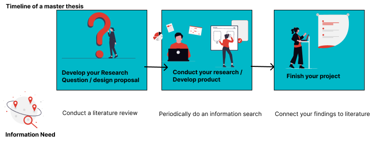

# 1b. Formulate an Information Search Question

## Introduction

Once you have your topic, it is time to formulate an information search question. This is a process that requires time and thought, and importantly; specifying exactly what you want to study. What information do you need to further shape your project?

The terms research question and information search question are sometimes used interchangeably. In this guide we distinguish between information search questions and research questions. We define them as follows:

- A research question is the focus of you master thesis project, something _you_ want to design or research. The answer of a research question commonly cannot be found in literature, but by experimenting and prototyping.

- Information search questions help you find out what _others_ have designed or researched about your topic or research question. They are directly related to your (draft) research question, but can be answered by conducting a literature search.

There are specific moments when relating to what others have written is necessary: 



1. Beginning of your project: Usually you do an in-depth search on what others have done (literature review), based on a preliminary research question.
2. Conducting your research: Articles help you shape your project, they can help you find new directions when your project is stuck, or new sources to read. 
3. When you finish your project, you connect your findings to what others have done. 


::::{grid}
:gutter: 2

:::{grid-item-card} Step 1<br>
[Define Components](#step-1-defining-components-of-an-information-question)<br>
Define the initial building blocks of your question

:::

:::{grid-item-card} Step 2<br>
[Specify Further](#step-2-further-specifying-your-question)<br>
Break your question down into broader or more narrow components

:::

::::

## Step 1: Defining Components of an Information Question

When you have done an initial exploration of your sources, take your mind map or summaries and try to formulate an information search question. You should define the who, what, where and why you are going to study. 

<a href="https://libguides.uvt.nl/tip-tutorial/research-question" target=_blank>Tilburg University</a> has some good considerations on formulating a relevant question for an information search (Lier, M. van, n.d.). It should be: 
- Clear
- Specific
- Manageable within the time you have

### Example Research scenario

Once you have gathered some information around your topic, you can use a concept map to structure and organise your initial brainstorm. In the concept map you visualise the relations and dependencies of a topic by connecting them with branches, which gives you a clearer overview of your subject. You can then use the concept map to formulate various information search questions by looking at the relations and dependencies of different branches of the concept map.

<br>
<a href= "https://www.tudelft.nl/tulib/searching-resources/making-a-search-plan" target=_blank>"Concept Map"</a> from <a href= "https://www.tudelft.nl/tulib" target=_blank>TUlib</a> is licensed CC-BY-SA<br>

From this concept map we have formulated the following research question:

- **“How can the print quality of inkless printing be improved by using optical technology?”**
Another possible research question could be:
- **“How does inkless printing by optical technology influence the energy consumption of the printing industry?”**

Want to learn more about how to get started with conceptmapping? Have a look at <a href="https://www.youtube.com/watch?v=v_8rNiW4A9A" target=_blank>this video about concept mapping</a>

## Step 2: Further Specifying Your Question
To further specify your question and make it more manageable, it can be helpful to divide it into sub-questions. In order to answer the information search question “How can the print quality of inkless printing be improved by using optical technology?”, you should formulate a number of sub-questions to further specify your search:

| Question | Explanation | Example |
|----------|-------------|---------|
| **What?** | Definitions of terms | What is the definition of print quality?<br>What kinds of optical technology are used in printing? |
| **How?** | Relations between terms | How can optics technology influence the print quality? |
| **Why?** |  Benefits of Research | Why would you improve inkless printing technology? |
| **Who?** | Target Group | Who would benefit of wider use of inkless printing technology? |
| **Where?** | Geographical Demarcation | Where would the improved inkless printing technology be most of use? |

A research topic can consist of multiple terms. The ‘What’ and ‘How’ sub-questions can therefore be posed multiple times.
Very often, you won’t be able to answer all five types of sub-questions. The ‘What’ and ‘How” sub-questions must always be posed, but the why, who and where questions depend on how specific your research topic is.

```{admonition} THESIS SUPERVISOR
:class: important
Once you have formulated an initial information search question, this is a great moment to get feedback from your supervisor. You can also try to explain your research idea to a fellow student, it will likely help to further shape your questions.
```


## References
- Lier, M. van. (n.d.). LibGuides: Tackling Information Problems (TIP): Formulate your research question. Retrieved March 4, 2026, from https://libguides.uvt.nl/tip-tutorial/research-question

