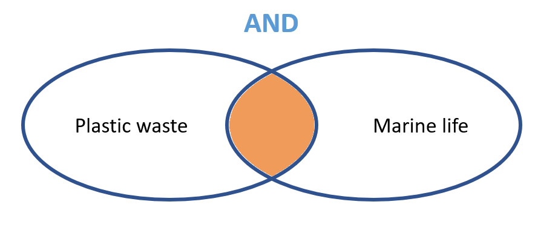
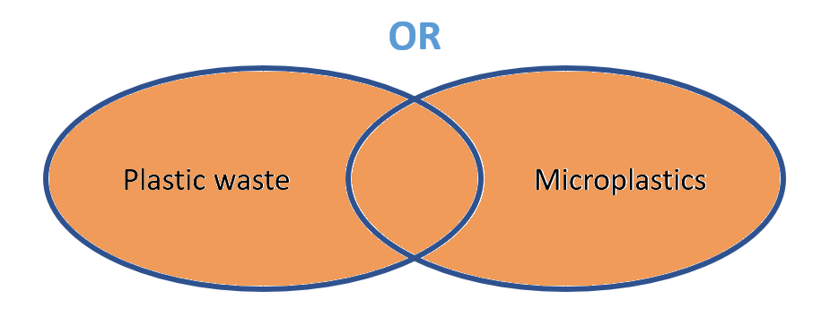
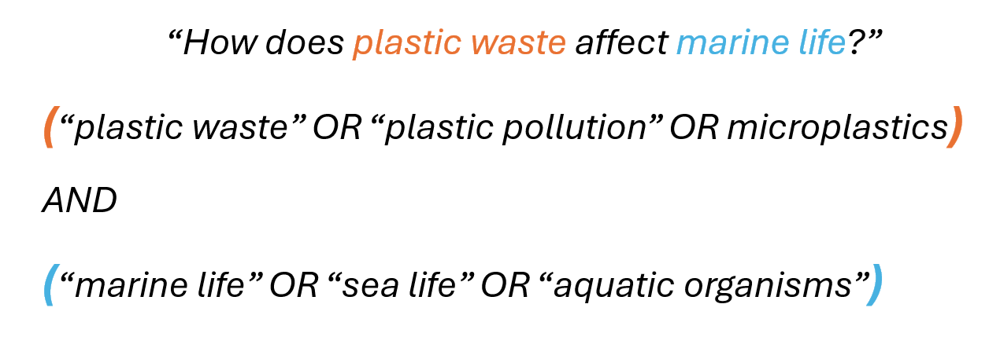
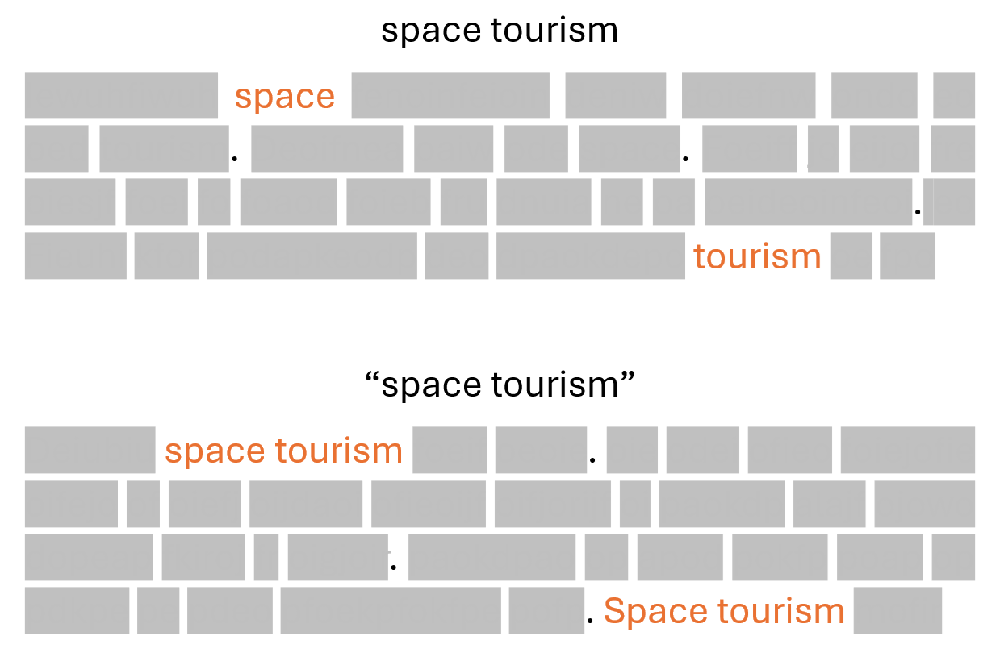
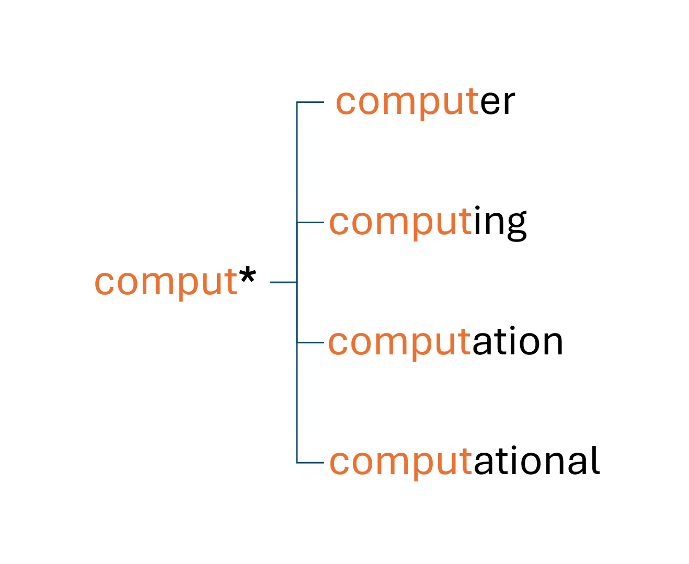

# 2b. Create a Keyword Search

## Introduction

Developing a keyword search strategy is the basis of searching for specific information to use in your research project. With a keyword search strategy, you break down your information search question into specific parts and translate them into a query that can be used in a database of your choice. 

When developing keyword searches for an academic database you should combine multiple synonyms with Boolean operators to create a query to search in a database of your choice. Following this process step-by-step is crucial to make sure you do a thorough search of all available literature

Watch this short recap of the keyword search process:

<iframe width="560" height="315" src="https://www.youtube.com/embed/8XnbdXkRPQk?si=ZXcRn1XUnmeLZET0" title="YouTube video player" frameborder="0" allow="accelerometer; autoplay; clipboard-write; encrypted-media; gyroscope; picture-in-picture; web-share" referrerpolicy="strict-origin-when-cross-origin" allowfullscreen></iframe><br>
"<a href="https://www.youtube.com/embed/8XnbdXkRPQk?si=ZXcRn1XUnmeLZET0" target=_blank>Keyword Searching</a>" by <a href="https://www.tudelft.nl/library/" target=_blank>TU Delft Library Education Support</a> is licensed under <a href=https://creativecommons.org/licenses/by/4.0/ target=_blank>CC-BY</a><br><br>

::::{grid}
:gutter: 3

:::{grid-item-card} Step 1<br>
[Identify Concepts](#1-breaking-research-question-down-into-concepts)<br>
Break down your information search question into concepts
:::

:::{grid-item-card} Step 2 <br>
[Synonyms](#step-2-finding-enough-synonyms-for-each-search-concept)<br>
For each concept include a good number of synonyms
:::

:::{grid-item-card} Step 3 <br>
[Combine](#step-3-combining-search-concepts-into-a-basic-search-query-for-an-academic-database)<br>
Combine your terms using search operators to translate your query for an academic database

:::

::::


## Step 1: Breaking Research Question Down into Concepts
Most research topics or sub-questions can be split into separate concepts. The concepts should be specific to your information search question. These are the main building blocks of the information search question or its main focus areas. 

Imagine that you’re working on the following information search question: 

**“How does 3D printing affect the cost of manufacturing of medical implants?”**

This question contains the following concepts:
1.	3D printing
2.	Cost of manufacturing
3.	Medical implants

How to identify concepts:

- Focus on the big ideas, not the filler words.
- Start with the nouns: these are often main concepts.
- Exclude any words that tell you how to answer the question (e.g. “evaluate”, “compare”, “outline”, “discuss”).
- Avoid articles (“a”, “an”, “the”), prepositions ("on", "in", “at”, etc.) and question words ("who”, “what”, “why”, “when”, “where”, “how”, etc.)
- Aim for 2-4 main concepts. 
(Brodhead, 2025; University of Sydney Library, n.d.)

```{admonition} Guided Activity: Identifying Concepts from your Information Search Question
:class: dropdown tip

Your information search question likely contains several **core concepts**—the big ideas that form its building blocks. Being able to clearly identify these will help you design better search strategies, structure your literature review, and stay focused in your research.  

**Steps:**  
1. Write down your question (or one of your sub-questions).  
2. Highlight the nouns and key terms that represent the big ideas.  
3. Remove filler words, prepositions, and question words (e.g., “how,” “why,” “in”).  
4. Aim to narrow it down to **2–4 main concepts**. 

**Example:**  
Question: *“How does 3D printing affect the cost of manufacturing of medical implants?”*  
Main concepts:  
- 3D printing  
- Cost of manufacturing  
- Medical implants  

**Reflection questions:**  
- Which words in my search question are truly central, and which ones can I ignore for now?  
- Do my chosen concepts cover the main focus areas of my research without being too broad?  

```

## Step 2: Finding Enough Synonyms for Each Search Concept
Next let’s talk about synonyms. When writing your keyword search strategy, you should think of at least 3 synonyms for each concept. Why do you need synonyms? This is because researchers might use different terms for a concept. Using different combinations of these words will help you capture a wider range of relevant articles and avoid missing important research just because an author used different wording.

Example:
In the information search question
**How does 3D printing affect the cost of manufacturing of medical implants?**

You have the following three concepts:

1. 3D printing  
2. Cost of manufacturing  
3. Medical implants  

Potential Synonyms and Alternative Terms for each could then be:

| 3D Printing             | Cost of Manufacturing   | Medical Implants             |
|--------------------------|-------------------------|-------------------------------|
| Additive manufacturing   | Production cost         | Prosthetics                  |
| AM                       | Manufacturing expenses  | Surgical implants             |
| On-demand manufacturing  | Fabrication cost        | Implantable medical devices   |
|                          | Cost efficiency         |                               |

Where should you look? You can search for the different concepts on Google or Wikipedia. If you are allowed to use AI, you could also use Copilot to find synonyms. Alternatively, already do a search in the databases you want to use and check the abstracts, are there maybe some interesting terms that already stand out?

```{admonition} Guided Activity: Finding Synonyms
:class: dropdown tip

Once you have identified the **main concepts** in your information search question, the next step is to think of synonyms and alternative terms. This ensures your search strategy captures the different ways authors may describe the same idea, helping you find a broader range of relevant literature.  

**Steps:**  
1. Take your 2–4 main concepts from your information search question.  
2. For each concept, brainstorm at least **3 alternative terms or synonyms**.  
3. Use different sources to find inspiration:  
   - Wikipedia or Copilot entries for your concepts  
   - Abstracts and keywords from preliminary database searches  
   - Textbooks, review papers, or glossaries in your field  
4. Create a table with your concepts in the first row and list the synonyms beneath each.  

**Example:**  
Concepts from the question *“How does 3D printing affect the cost of manufacturing of medical implants?”*  

| 3D Printing             | Cost of Manufacturing   | Medical Implants             |
|--------------------------|-------------------------|-------------------------------|
| Additive manufacturing   | Production cost         | Prosthetics                  |
| AM                       | Manufacturing expenses  | Surgical implants             |
| On-demand manufacturing  | Fabrication cost        | Implantable medical devices   |
|                          | Cost efficiency         |                               |

**Reflection questions:**  
- Do my synonyms include both formal/technical terms and informal/common variations?  
- Which synonyms are most likely to appear in the databases and journals relevant to my discipline?  

**Call to action:**  
Add your table of concepts and synonyms to your [Search Strategy Handout] so you can begin testing them in your database searches.  

```

## Step 3: Combining Search Concepts into a Basic Search Query for an Academic Database

Once you have enough synonyms for your concepts you can bring it together into something called a “query”, which is what you will enter in your database of choice. A query is simply your research question rewritten with keywords and search operators, in a form the search system can process to find exactly what you need. A query is a combination of the different concepts. You do this using the Booleans AND and OR. These are search operators that tell a database what to do with the keywords. Search operators like parentheses, quotation marks and asterisks should be used to further refine your query. Go through the tabs below to refresh your memory on how to use them correctly:


````{tab-set}

```{tab-item} AND

AND tells the system you want both keywords to appear in your results.

```

```{tab-item} OR

OR tells the system you’re fine with at least one of the keywords appearing (or both).

```
```{tab-item} Nesting

Nesting is a search technique that uses parentheses to group terms, so you can tell the database exactly how to process your search request. Think of it like math: parentheses tell the system which operations to do first.

```
```{tab-item} Phrase Searching

Quotation marks tell the system to look for the words inside the quotation marks as a single phrase, rather than as separate words.

```
```{tab-item} Wildcard

Wildcards are special symbols that act as “placeholders,” telling the system that zero, one, or more characters can appear in their place. This lets you capture multiple versions of a word in one go, saving time and broadening your search.
The most common wildcard is the asterisk \*, which can be placed at the middle or end of a word (but usually not at the beginning).
For example, if your topic involves computers, typing comput* will include many related word forms.
```

```{tab-item} Proximity Operators (expert)
Some search systems allow the use of proximity operators such as **NEAR**, **W** (“within”), or **AROUND** to indicate that two search terms must appear near each other. See the following table for a few examples, or check the help file of the search system you are using for more information.

| Database                       | Proximity operator | Example and explanation        | Explanation                                                                 |
|--------------------------------|--------------------|--------------------------------|-----------------------------------------------------------------------------|
| Scopus                         | `PRE/n`            | `solar PRE/3 energy`           | The word “solar” precedes the word “energy” by 3 or fewer words.            |
| Scopus                         | `W/n`              | `energy W/50 solar`            | The word “solar” must appear within 50 words of the word “energy”. It does not matter in which order the words appear. |
| Google Scholar                 | `AROUND(n)`        | `energy AROUND(15) solar`      | The words “energy” and “solar” must appear within 15 words of each other.   |

**Notes:**
- `n = 3–5`: the words appear in the same phrase  
- `n ≈ 15`: the words appear in the same sentence  
- `n ≈ 50`: the words appear in the same paragraph  

```
````
"Boolean Operators" by <a href="https://www.tudelft.nl/library/" target=_blank>TU Delft Library Education Support</a> is licensed under <a href=https://creativecommons.org/licenses/by/4.0/ target=_blank>CC-BY</a><br><br>


Let’s take this information search question as an example to see how we can combine all the concepts together:

**“How does wind energy integration impact power grid stability?”**

From this, we identified the following concepts and keywords:

| Wind energy | Power grid         | Stability   |
|-------------|--------------------|-------------|
| Wind power  | Electricity network| Reliability |
| Turbine     | Energy grid        | Resilience  |
|             | Electric grid      | Security    |

To build your query:
1.	Use OR to connect all the keywords for each concept, and place them in parentheses.
2.	Use AND to connect the different concepts together.
3.	Put quotation marks (“…”) around phrases so the words appear together.
4.	Use wildcards (*) for words that have multiple endings or variations.

Here is what a query looks like for this research question:
("wind energy" OR "wind power" OR turbine*) AND ("power grid" OR "electricity network" OR "energy grid" OR "electric grid") AND (stability OR reliab* OR resilien* OR secur*)

```{admonition} Guided Activity: Combining Concepts
:class: dropdown tip

Now that you’ve gathered synonyms for your concepts, it’s time to **combine them into a search query**.

**Steps:**  
1. Take the list of synonyms you generated for each of your 2–4 main concepts.  
2. For each concept, connect the synonyms with **OR** and enclose them in parentheses.  
   - Example: ("wind energy" OR "wind power" OR turbine*)  
3. Connect the different concept groups with **AND**.  
   - Example: (…wind terms…) AND (…grid terms…) AND (…stability terms…)  
4. Use **quotation marks** around multi-word phrases to keep them together.  
   - Example: "power grid"  
5. Apply **wildcards (*)** where helpful to catch variations.  
   - Example: reliab* → reliable, reliability  
6. If your database supports it, experiment with **proximity operators** to refine how closely words should appear together.  

**Reflection questions:**  
- Does my query balance **breadth** (enough synonyms to capture variety) with **focus** (precise enough to avoid irrelevant results)?  
- Which database-specific features (wildcards, proximity, nesting) could make my query more powerful?  

**Call to action:**  
Write and save your first complete search query in your [Search Strategy Handout], then test it in one academic database of your choice. Adjust as needed based on the results you see.  
```

## Practice with a Research Scenario

Complete the exercise below to practice with a research scenario

<iframe src="https://tudelft.h5p.com/content/1292799264273572337/embed" aria-label="2 - KC - Create a Keyword Search" width="1088" height="637" frameborder="0" allowfullscreen="allowfullscreen" allow="autoplay *; geolocation *; microphone *; camera *; midi *; encrypted-media *"></iframe><script src="https://tudelft.h5p.com/js/h5p-resizer.js" charset="UTF-8"></script><br>
"<a href="https://tudelft.h5p.com/content/1292799264273572337/embed" target=_blank>Practice with Creating a Keyword Search</a>" by <a href="https://www.tudelft.nl/library/" target=_blank>TU Delft Library Education Support</a> is licensed under <a href=https://creativecommons.org/licenses/by/4.0/ target=_blank>CC-BY</a><br><br>

## References

- Brodhead, T. (2025). Guides: Research Tips and Tricks: Breaking Topic Into Keywords. Retrieved March 4, 2026, from https://kingsu.libguides.com/research/keywords
- University of Sydney. (n.d.). Identifying concepts in a research topic. Retrieved March 2, 2026, from https://www.library.sydney.edu.au/support/searching/identifying-keywords-in-a-research-topic
