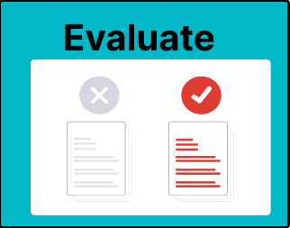

# 3. Evaluate and Select Sources

Now that you have done your initial search, analysed and refined your search results, it is time to select sources that you will read for your master thesis. Sources come with limitations. Some might not be reliable enough for you to build your research on, or they are not sufficiently relevant for your project. It is therefore important that before you select something to start processing, you make sure you know what you would like to use it for, and that the source is reliable! Will you use it in the methods section of your thesis? Is it a case study that can provide some additional background for your introduction? And how can you store and organize your new-found sources? 

Common activities during this phase of your information journey include:

- [3a. Limitations of Sources](3a-limitations-of-sources.md) - Understand the limitations of AI and other Sources
- [3b. Evaluate Sources Broadly](3b-evaluating-sources.md) - Assess the relevance and reliability of sources
- [3c. Select Effectively](3c-select-effectively.md) - Select academic literature
- [3d. Store Sources](3d-store-sources.md) - Use reference managers and tagging to store your sources

## Template for Evaluating and Selecting
You can use the [Select Template](3-template-evaluate.docx) to fill in as you go through academic sources you want to select and store for your master thesis.
