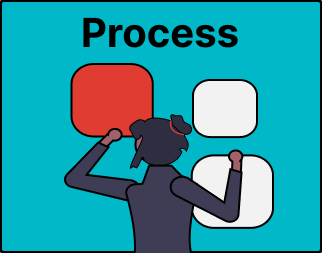

# 4. Process Sources

## Introduction

When you have selected the sources you want to use for your MSc thesis, it is time to process them. You need to build your research project on quality sources at the start of your project, and you need to go back to your sources and connect your own research outcomes to what others have found. Processing helps you engage with your sources on a deeper level. By strategcally reading and summarising, you will understand the contents of your sources better, and the process of synthesising helps you to connect multiple sources together and to add your own voice and critical analysis. 

Common activities during this phase of the your information journey include:

- [4a. Read](4a-read.md) - being able to effectively read literature for your thesis
- [4b. Summarise](4b-summarise.md) - summarise your findings
- [4c. Synthesise](4c-synthesise.md) - comparing sources, or connecting the findings in the literature to your research results

## Test Your Knowledge
Before studying the recap and additional skills useful for your master thesis; take this knowledge test to find out how much you already know:

<iframe src="https://tudelft.h5p.com/content/1292839990590939467/embed" aria-label="4 - Process - Knowledge Test" width="1088" height="637" frameborder="0" allowfullscreen="allowfullscreen" allow="autoplay *; geolocation *; microphone *; camera *; midi *; encrypted-media *"></iframe>

## Template for Process
The template for Process is still under development. 
