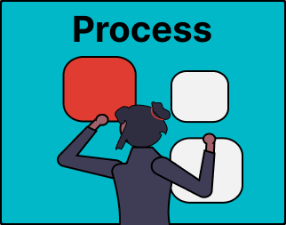

# 4. Process Sources

## Introduction

If everything is going right in your information search quest, you now have three things:
1.	A broad sense of your topic, what you know about it and what you have yet to learn.
2.	A set of information search questions, linked to your research topic or design challenge. 
3.	A list of sources (such as articles, conference proceedings, books, news-items) that you found and selected, based on their relevance and reliability. 

When you have selected the sources you want to use for your master thesis, it is time to process them. You need to build your research project on quality sources at the start of your project, and you need to go back to your sources and connect your own research outcomes to what others have found. Processing helps you engage with your sources on a deeper level. By strategically reading and summarising, you will understand the contents of your sources better, and the process of synthesising helps you to connect multiple sources together and to add your own voice and critical analysis. 

Common activities during this phase of the your information journey include:

- [4a. Read](4a-read.md) - being able to effectively read literature for your thesis
- [4b. Summarise](4b-summarise.md) - summarise your findings
- [4c. Synthesise](4c-synthesise.md) - comparing sources, or connecting the findings in the literature to your research results

## Template for Process
The template for Process is still under development. 
