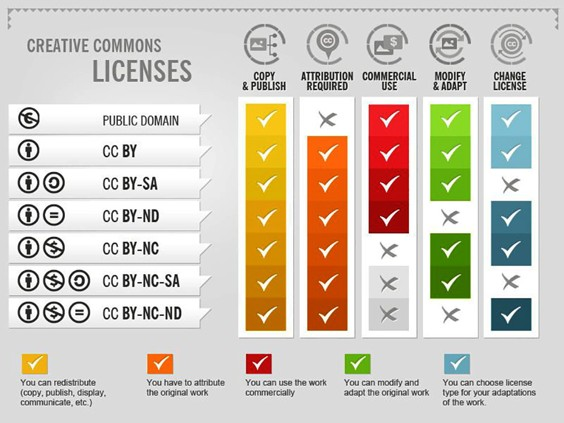

# 5c. Copyright

## Introduction

Your thesis is your work. If others want to reuse it, it is only logical that someone gives you credit for all the hard work you put in. On the other hand, if you reuse the work of others in your thesis, you should also credit them for the work they did. When you are reusing figures, data, images or other works by others you will have to make sure that you credit the creators accordingly.

This is what copyright is about. It helps set the conditions under which others may reuse your work, or help you understand how you can reuse the work of others. It’s important that you know exactly how to do this correctly, and it’s also important to know how to protect your own published work.

Have a look at this video that explains copyright in more detail:

<iframe width="560" height="315" src="https://www.youtube.com/embed/ZqFXYDrZt7c?si=mPe9nIo1zl8VBnIo" title="YouTube video player" frameborder="0" allow="accelerometer; autoplay; clipboard-write; encrypted-media; gyroscope; picture-in-picture; web-share" referrerpolicy="strict-origin-when-cross-origin" allowfullscreen></iframe><br>
"<a href=https://www.youtube.com/embed/ZqFXYDrZt7c?si=mPe9nIo1zl8VBnIo target=_blank>Copyright in 2 minutes</a>" by <a href= "https://www.auteursrecht.nl/" target=_blank>Auteursrecht.nl</a>. No further reuse is allowed<br><br>

::::{grid}
:gutter: 3

:::{grid-item-card} Step 1<br>
[Recognise Copyrighted Works](#step-1-recognise-copyrighted-works)<br>
Know what works are copyrighted
:::

:::{grid-item-card} Step 2 <br>
[Using Right to Quote](#step-2-using-right-to-quote)<br>
Understand how to use your right to quote copyrighted works
:::

:::{grid-item-card} Step 3 <br>
[Know Your Own Rights](#step-3-taking-care-of-your-own-copyright)<br>
License your own work

:::

::::


## Step 1: Recognise copyrighted works

When using someone else’s copyrighted work, attribute copyrighted work in the manner specified by the creator of the work. In many works this is clearly mentioned. In some cases you will need to contact the creator to ask permission to use or reuse the work.

```{admonition} Warning: Always check before reusing someone's work!
:class: warning
Almost all work is copyrighted, and if you want to reuse it, you need to know if you have permission to do so. It is not enough to simply cite where something is from, you need to check if you are allowed to reuse it.
```

If a work is in the public domain (from 70 years after the death of the maker of a work if the copyright holder is a physical person, or after the year of the first publication if the copyright holder is a legal person), you don’t have to ask for permission but you have to mention that it belongs to “the public domain”.

```{admonition} Exceptions for copyright permissions
:class: dropdown note

You have to ask for permission from the copyright holder to reproduce an image, photo, table, or figure, except in the following cases:

- If the image has a creative common license
- If the image is in the public domain (PD)
- If tables and figures from academic sources are for educational use or non-commercial research only. In this case, mention the author and the publisher as copyright holders.
- If you bought the license of a photo from a stock photography website. You do not need to mention the website, but give credits to the creator/copyright holder depending on what the license you bought states.
- If you use clip art from a free clip art website.
- If you stick to the rules of “fair use” (non-commercial use; only educational or academic use; use of just a small part of the original work; use only what is necessary).
```

### Where to find copyright information?
When reusing someone's work you should check the work for the copyright license. If it is online often this will be somewhere on the about page or at the bottom of the site. 

Symbols you will likely encounter are: (©) , or a statement like "all rights reserved." When statements like this are included in the work you should ask for permission if you want to reuse it. If copyright information is missing or cannot be found, this doesn't mean that the work is not copyrighted. Instead, you should assume that the work is copyright-protected and ask for permission to reuse (Wageningen University Library, n.d.).

However, there are also more open licenses that allow you to reuse a work without asking for permission. For example, the Creative Commons licenses. These are free copyright licenses which let others know under which conditions they can reuse your work. There are a variety of licenses, with different levels of openness. One of the most open and commonly used is called CC-BY: meaning others can reuse your work freely, as long as they give you credit. You will find them in similar locations as the copyright statements. Another license that allows you to reuse a work freely is when the copyright holder waives their copyright (CC0).

Not all creative commons licenses allow you to reuse the source freely. There might for example be limitations on the purpose of reusing the work (for example, CC-BY-NC means you can reuse the work, but not for commercial purposes), or on if you can adapt the work (For example, CC-BY-ND means you can reuse the work, but you are not allowed to change it). The image below gives an overview of the different Creative Commons licenses you might encounter and what you are allowed to do with the work:

<br>
"<a href=https://foter.com/blog/how-to-attribute-creative-commons-photos/ target=_blank>How to attribute creative commons photos"</a>" by <a href=https://foter.com/ target=_blank>Foter</a> is licensed under <a href=https://creativecommons.org/licenses/by-sa/4.0/ target=_blank>CC-BY-SA</a><br><br>

Another license that allows you to reuse the work freely is when the work is in the public domain (PD).

## Step 2: Using Right to Quote

When reusing copyrighted figures, images, data or multimedia in your master thesis you can use your **right to quote** if you don't want to ask for permission. However, there are specific conditions that you need to meet to make sure this right applies, as stated by the <a href="https://www.tudelft.nl/library/support/copyright/student-copyright-answers#c1118751" target=_blank>TU Delft Copyright Information Point</a>:

- You can only do so for a **clearly identifiable purpose**.
- You may not quote **more than is strictly necessary**.
- You must **reference the source**.
- The source must have been **lawfully published**.

If one of these requirements is **NOT** met, you must ask for permission (for example by emailing the author, journal or organisation that created the work). You can only use the right to quote when strictly necessary. 

```{admonition} About Decorative Images
:class: warning 
If multimedia are used decoratively, they do **not** fall under the right to quote and students do have to ask permission or use one of the openly licensed works we discussed. An example is using a photograph on the cover of a thesis.
```

## Step 3: Taking care of your own copyright
You do not have to do anything to obtain copyright, such as a registration process or putting a copyright symbol (©) or statement in your work. It must be clear that you wrote or produced the work yourself.

What can be helpful when sharing your own work is choosing for a creative commons license. These are licenses that allow others to reuse your work according to your wishes. On the website of <a href="https://creativecommons.org/share-your-work/cclicenses/" target=_blank>Creative Commons</a> you can find more in depth information about the licenses. 

```{admonition} Tip
:class: tip 
If you have any specific questions about copyright, contact the <a href="https://www.tudelft.nl/library/support/copyright" target=_blank>Copyright Information Point</a>
```

## References
- Creative Commons. (n.d.). Share your work. Creative Commons. Retrieved March 2, 2026, from https://creativecommons.org/share-your-work/
- TU Delft Copyright Information Point. As a student, I want to re-use multimedia in my multimedia / student paper, thesis, etc. Retrieved April 2, 2026 <a href="https://www.tudelft.nl/library/support/copyright/student-copyright-answers#c1118751" target=_blank>https://www.tudelft.nl/library/support/copyright/student-copyright-answers#c1118751</a>
- Wageningen University Library. (n.d.). What is copyright? Retrieved March 2, 2026, from <a href="https://library.wur.nl/infoboard/Copyright/?utm_source=edusources.nl&amp;utm_content=link#page4" target=_blank>https://library.wur.nl/infoboard/Copyright/?utm_source=edusources.nl&amp;utm_content=link#page4</a>

