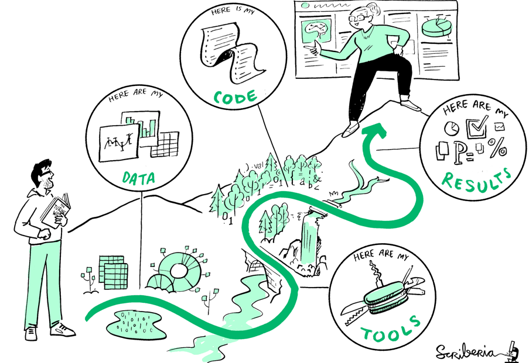

# 5d. Open Science

## Introduction
When you want to pursue a career in academia, or if you want to make sure your results can be used by others to build on further, it can help to understand a bit more of the principles of open science and common resources to get started. 

::::{grid}
:gutter: 2

:::{grid-item-card} Step 1<br>
[Know what open science is](#step-1-know-what-open-science-is)<br>
What is open science and what are the advantages?
:::

:::{grid-item-card} Step 2<br>
[Resources to get started](#step-2-common-resources-to-get-started)<br>
Some links to dive into more detail on the topic

:::

::::


## Step 1 Know What Open Science Is

Open Science is a collective name for a variety of practices. Underlying Open Science is the idea of disseminating scientific knowledge as widely as possible (Open Life Science, n.d.). 


This illustration is created by Scriberia with The Turing Way community. Used under a CC-BY 4.0 license.

Examples of Open Science:

````{tab-set}

```{tab-item} Open Access
Open Access publishing refers to free and open online access to academic publications. Ideally, an open access publication is available for anyone to read, download, copy, distribute, print, search for, search within, and use in research. So it means that people (including the general public, scientists, industry and policymakers) can access it for free, and they can use and build upon the results of scientific research, which leads to larger impact for individual research. 

Rather than sharing knowledge within a specific research community, Open Scientists reaches out to broader scholarly communities to work together, and also tell their research to the general public. With social media broader audiences can be reached, and analytics tools like Altmetrics illustrate how scientific knowledge circulates beyond academia. You can consult this <a href="https://library4research.tudl.tudelft.nl/2026/01/16/beyond-the-citation-a-deep-dive-into-altmetric-explorer-for-institutions/" target=_blank>blog post on Altmetrics</a> if you want to know more.
```

```{tab-item} Open Data
Open data is means data that is freely available for everyone to use, share and build on as they wish, without restrictions from copyright, patents or other mechanisms of control. Offering data openly is highly relevant to support transparency of research, for advancing innovation and multidisciplinary research and to increase the visibility of your work.
```

```{tab-item} FAIR software
FAIR software is about making available the tools researchers create for their research to the larger community.  A great example is <a href="https://www.zotero.org/" target=_blank>Zotero</a>, which is an open source reference manager developed as a project by the non-profit Corporation for Digital Scholarship, now used by researchers all over the world in different disciplines. 
```

```{tab-item} Citizen Science
In Citizen Science is a great way non-experts actively contribute to scientific research. A famous example of citizen science is <a href="https://zoo4.galaxyzoo.org/" target=_blank>Galaxy Zoo</a>, where since 2007 over 100.000 of volunteers have helped classify millions of galaxies. The success of the project spawned a platform, <a href="https://www.zooniverse.org/" target=_blank>Zooniverse</a>, where other citizen science projects now have a home. 
```
````
Examples of Open Science adapted from <a href="https://www.edx.org/learn/research/delft-university-of-technology-open-science-sharing-your-research-with-the-world" target=_blank>Open Science: Sharing Your Research with the World is licensed CC-BY-SA-NC</a>

Adhering to Open Science practices can be helpful, especially if you are aiming for a career as a researcher, or if you want to enable others to reuse your work. Some advantages include:

```{admonition} Advantages of Open Science
:class: dropdown note

- Wider visibility for your work inside and outside academia because your work is more open and found more easier by others

- Journals increasingly ask researchers to publish their data alongside their publications. If you are able to already do this responsibly, publishing becomes easier

- By making it easy to replicate your study, you improve the scientific system as a whole. 

- With open science, research and data are published open access. This means that everyone will have access to publications, regardless of which country or community they are from and what journals they subscribe to. In this way everyone across the globe can benefit from scientific research.
```
Advantages of Open Science adapted from <a href="https://www.edx.org/learn/research/delft-university-of-technology-open-science-sharing-your-research-with-the-world" target=_blank>Open Science: Sharing Your Research with the World is licensed CC-BY-SA-NC</a>

## Step 2: Common Resources to Get Started

Now that you know the principles of Open Science and have some examples, have a look at these resources if you want to study further how to conduct your research in an open manner:

- <a href="https://www.tudelft.nl/en/open-science" target=_blank>Open Science at TU Delft</a>
- <a href="https://www.coursera.org/learn/a-starters-guide-to-open-science/" target=_blank>"A starters guide to Open Science"</a> - a beginners course in Open Science by Erasmus University
- <a href="https://we-are-ols.org/" target=_blank>Open Life Science Limited</a> - a mentoring program on Open Science
- <a href="https://book.the-turing-way.org/" target=_blank>The Turing Way</a> - an online resource on how to practice open data science

## References
- Open Life Science. (n.d.). Open Science. Retrieved March 2, 2026, from https://we-are-ols.org/open-science.html
- Open Science: Sharing Your Research with the World. (n.d.). edX MOOC. Retrieved March 2, 2026, from https://www.edx.org/learn/research/delft-university-of-technology-open-science-sharing-your-research-with-the-world
